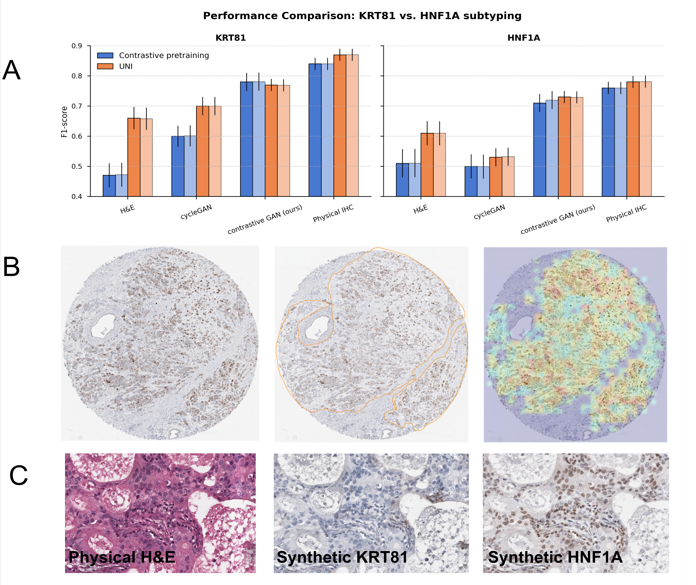

# Contrastive Virtual Staining

**Enhancing PDAC subtyping from routine H&E with synthetic IHC**

_Maximilian Fischer\*, Alexander Muckenhuber\*, Robin Peretzke, Luay Farah, Constantin Ulrich, Sebastian Ziegler, Philipp Schader, Lorenz Feineis, Hanno Gao, Shuhan Xiao, Michael Götz, Marco Nolden, Katja Steiger, Jens T. Sieveke, Lukas Endrös, Rickmer Braren, Jens Kleesiek, Peter Schüffler, Peter Neher†, Klaus Maier-Hein†_  
\* shared first authorship  
† shared last/senior authorship

---
## 🧠 Summary

This repository provides the code for the **Multiple Instance Learning (MIL)** framework used for **automatic subtyping of pancreatic ductal adenocarcinoma (PDAC)**.  
The model predicts the immunohistochemical (IHC)-based PDAC subtypes **KRT81-positive**, **HNF1A-positive**, or **double-negative**, from patch-level features extracted from histopathological whole-slide images (WSIs).

The MIL setup is designed for flexibility: it can use **H&E**, **IHC**, or **synthetic IHC** inputs — any feature set extracted from pathology slides.

---

## 🔍 Overview

### Problem
In PDAC diagnostics, IHC markers such as **KRT81** and **HNF1A** define clinically relevant subtypes, but manual IHC evaluation is time-consuming and subjective.

### Approach
We use **weakly supervised Multiple Instance Learning (MIL)**, where each patient-level label (subtype) supervises a bag of instance-level embeddings (image patches).  
The framework:
- aggregates thousands of patch-level features per slide,
- learns to identify subtype-relevant regions,
- outputs both patient-level predictions and interpretable attention maps.

---

## 🧩 Method Overview

### 1. Feature Extraction (input preparation)

Each whole-slide image (WSI) is tiled into small, non-overlapping patches (e.g., 224×224 px).  
For each patch, we extract features using one of two available encoders:

- **ResNet18 (contrastively pre-trained)**  
  A lightweight, domain-specific CNN trained via contrastive learning and fine-tuned on pathology data.
  
- **UNI pathology foundation model**  
  A large CLIP-style ViT trained on millions of pathology image–text pairs (used frozen as a universal feature extractor).

For each patch, we obtain a 512-dimensional (ResNet18) or 2048-dimensional (UNI) feature vector.  
Each patient’s WSI corresponds to one *bag* of patch embeddings — typically 1000–1200 patches per slide.

We use **dual-scale feature extraction**:
- 40× magnification for local texture / staining signal
- 20× magnification for contextual information

During feature extraction, we apply random augmentations (color jitter, grayscale, Gaussian blur, flips, noise).  
These augmentations are stored so that each patch embedding can be randomly replaced with one of its augmented variants during training.

---

### 2. Multiple Instance Learning (MIL) Architecture

We employ a **DSMIL** (Dual-Stream MIL) architecture:

- **Instance classifier:** predicts instance-level (patch-level) logits.
- **Bag classifier:** aggregates patch embeddings into a bag representation and predicts slide-level (bag-level) class.

Both components are trained jointly.
Download the model checkpoint from here: https://drive.google.com/drive/folders/1PLTbDy2WQ6eQvndkfTYaISqzMbQrR1n_?usp=drive_link

#### Loss function

The final objective combines bag-level and instance-level cross-entropy losses:

\[
L = L_{bag} + \lambda \cdot L_{instance}
\]

with a weighting factor **λ = 0.2**, balancing global (bag) and local (instance) supervision.

#### Training setup

| Parameter | Value |
|------------|--------|
| Epochs | 3000 |
| Optimizer | AdamW |
| Learning rate | 0.0002 |
| Patch dropout | 0.1 |
| Node dropout | 0.3 |
| Batch size | 1 bag |
| Loss | Binary Cross-Entropy |
| Tasks | KRT81-pos/neg, HNF1A-pos/neg |

---

### 3. Classification Tasks

We perform **two independent binary classification tasks**:
1. KRT81 positive vs negative  
2. HNF1A positive vs negative  

These predictions can later be combined into a 3-class scheme (KRT81+/HNF1A+/double-negative) if desired.

---

### 4. Evaluation

- **Cross-validation:** 5-fold, stratified at the **patient level** (no leakage).
- **Metrics:** F1-score (primary), Precision, Recall, ROC-AUC.
- **Reasoning:** F1 emphasizes clinical relevance by balancing recall and precision for imbalanced subtype frequencies.

#### Typical Results (5-fold CV)

| Marker | Feature Extractor | Input | F1-Score |
|---------|-------------------|--------|-----------|
| **KRT81** | UNI | IHC | 0.87 |
|           | UNI | Synthetic IHC | 0.77 |
|           | UNI | H&E | 0.66 |
| **HNF1A** | UNI | IHC | 0.78 |
|           | UNI | Synthetic IHC | 0.73 |
|           | UNI | H&E | 0.61 |
---




## License
This project is made avialble under the CreativeCommons License. See the license file for more details.
## Reference
If you find our work useful in your research or use parts of this code please consider citing our paper:
```
@article{contrastivevirtualvstaining,
  title={Contrastive virtual staining enhances deep learning-based PDAC subtyping from H&E-stained tissue cores},
  author={},
  journal={},
  year={},
  publisher={}
}

```
Also reference the primary tools that we used:
```
@article{chen2024towards,
  title={Towards a general-purpose foundation model for computational pathology},
  author={Chen, Richard J and Ding, Tong and Lu, Ming Y and Williamson, Drew FK and Jaume, Guillaume and Song, Andrew H and Chen, Bowen and Zhang, Andrew and Shao, Daniel and Shaban, Muhammad and others},
  journal={Nature medicine},
  volume={30},
  number={3},
  pages={850--862},
  year={2024},
  publisher={Nature Publishing Group US New York}
}
```
```
@inproceedings{li2021dual,
  title={Dual-stream multiple instance learning network for whole slide image classification with self-supervised contrastive learning},
  author={Li, Bin and Li, Yin and Eliceiri, Kevin W},
  booktitle={Proceedings of the IEEE/CVF conference on computer vision and pattern recognition},
  pages={14318--14328},
  year={2021}
}
```
```
@inproceedings{ilse2018attention,
  title={Attention-based deep multiple instance learning},
  author={Ilse, Maximilian and Tomczak, Jakub and Welling, Max},
  booktitle={International conference on machine learning},
  pages={2127--2136},
  year={2018},
  organization={PMLR}
}
```

## Copyright
Copyright German Cancer Research Center (DKFZ) and contributors.
Please make sure that your usage of this code is in compliance with its
license.


## Acknowledgement
This work was partially funded by the Research Campus M2OLIE, which was funded by the German Federal Ministry of Education and Research (BMBF) within the Framework “Forschungscampus: Public-private partnership for Innovations” under the funding code 13GW0388A.